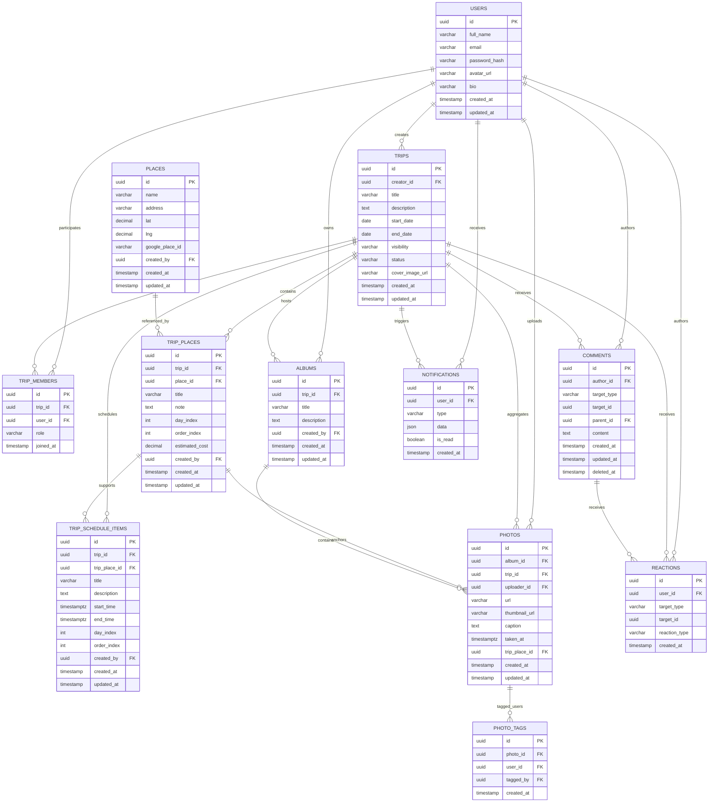

# Planning Trip

## 1) Mô tả dự án

Planning Trip là ứng dụng web hỗ trợ nhóm lập kế hoạch chuyến đi theo lộ trình. Mỗi chuyến đi được thể hiện như một bài đăng cho phép:

- Tạo danh sách địa điểm và gợi ý tuyến đường.
- Hiển thị các địa điểm lên bản đồ tương tác.
- Lên timetable/schedule chi tiết theo từng ngày và giờ.
- Thành viên khác bình luận, thả cảm xúc cho từng điểm hoặc toàn bộ chuyến đi.
- Đóng góp ảnh vào album chung kèm chú thích và cảm nhận cá nhân.

Ví dụ: Quý Nguyễn tạo plan Nha Trang, thêm Tháp Bà, Vinpearl Land, xếp lịch theo thứ tự ngày. Các thành viên khác thấy bản đồ, timetable, bình luận, thả cảm xúc và tải ảnh lên album chung.

## 2) Mục tiêu sản phẩm

- Giúp nhóm lên kế hoạch chuyến đi trực quan, có bản đồ và lịch trình rõ ràng.
- Tạo không gian tương tác giữa thành viên bằng bình luận, reaction, góp ý.
- Lưu giữ kỷ niệm chuyến đi qua album ảnh đóng góp chung.

## 3) Phạm vi MVP

- Quản lý người dùng, thành viên của một trip.
- Tạo/chỉnh sửa/xem thông tin trip.
- Thêm địa điểm và hiển thị trên map.
- Quản lý timeline/schedule cho từng ngày đi.
- Bình luận và reaction cho trip, địa điểm, ảnh.
- Album ảnh chung, người dùng có thể upload và bày tỏ cảm nghĩ.

## 4) Các vai trò và quyền hạn

- **Owner**: tạo trip, mời/thu hồi thành viên, chỉnh sửa toàn bộ nội dung.
- **Editor**: chỉnh sửa địa điểm, lịch trình, nội dung trip.
- **Viewer**: xem trip, bình luận, reaction, đóng góp ảnh nếu được cấp quyền.

## 5) Danh sách thực thể nghiệp vụ

- `User`
- `Trip`
- `TripMember`
- `Place`
- `TripPlace`
- `TripScheduleItem`
- `Comment`
- `Reaction`
- `Album`
- `Photo`
- `PhotoTag` (tuỳ chọn)
- `Notification` (phase 2)

## 6) Diagram

## 7) Quan hệ chính

- Một `user` có thể tạo nhiều `trips`.
- Một `trip` liên kết với các `trip_members`, `trip_places`, `schedule_items`, `comments`, `reactions`, `albums`.
- Một `album` chứa nhiều `photos`.
- `comments` và `reactions` dùng cặp `target_type` + `target_id` để hỗ trợ nhiều kiểu đối tượng.
- `places` chuẩn hóa dữ liệu vị trí để tái sử dụng giữa các trip.

---

Author: Selten03 aka Nguyễn Thi Quý  
Contact: quy021003@gmail.com  
Linkedin: https://www.linkedin.com/in/nguyenquythi/
