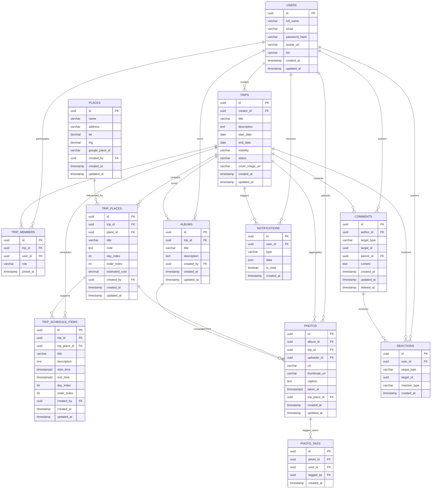

# ERD - Planning Trip

Đây là sơ đồ ERD mô tả các bảng cốt lõi của dự án Planning Trip cùng các mối quan hệ chính.

## Diagram

## Ghi chú
- `target_type` trong `comments`/`reactions` hỗ trợ đa hình, cho phép bình luận/reaction trên `trip`, `trip_place`, `photo`.
- `trip_places` tham chiếu `places` để tái sử dụng vị trí và giữ dữ liệu bản đồ chuẩn.
- `photo_tags` cho phép gắn người tham gia vào mỗi bức ảnh.
- `notifications` là bảng mở rộng cho các thông báo người dùng.
